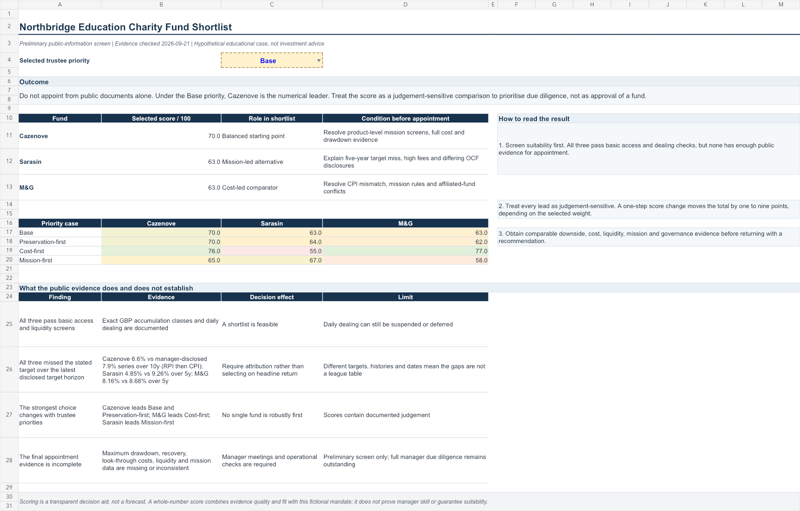

# UK Charity Multi-Asset Fund Due Diligence

This project develops a preliminary, desk-based fund shortlist for a fictional UK education charity. It compares exact GBP accumulation share classes using official public documents, an explicit suitability screen and an evidence-anchored scorecard.

The work is not full manager due diligence, regulated investment advice or a recommendation to transact.

**Evidence checked:** 21 September 2026

## Decision summary

The public evidence does not support appointing any fund without further due diligence.

Under the base weights, Cazenove ranks first with 70/100; M&G and Sarasin each score 63. The correct interpretation is:

- **Cazenove:** balanced starting point for manager discussions
- **M&G:** cost-led comparator
- **Sarasin:** mission-led alternative

The numerical leader changes when trustee priorities change. Cazenove leads the base and preservation-first cases, M&G leads the cost-first case, and Sarasin leads the mission-first case. There is therefore no unconditional winner.

## Fictional mandate

| Item | Assumption |
|---|---|
| Long-term investment pool | £10.0 million |
| Separate liquidity reserve | £450,000, equal to 18 months of planned spending |
| Annual spending | £300,000, or 3.0% of the long-term pool |
| Horizon | More than 10 years |
| Objective | UK CPI + 3% a year after fund costs over rolling five-year periods |
| Risk governance | A fall near 15% triggers trustee review; it is not a guaranteed loss limit |
| Liquidity | Daily or weekly dealing, with the reserve held outside the fund |
| Mission review | Look-through assessment of tobacco, controversial weapons and investments that may conflict with the education mission |

CPI + 3% net is internally consistent with preserving real capital while funding a 3% spending rule if achieved. It is not a forecast, and the liquidity reserve does not protect the invested pool from market losses.

## Funds reviewed

| Fund | Exact share class | ISIN |
|---|---|---|
| SUTL Cazenove Charity Multi-Asset Fund | Class Z Accumulation GBP | GB00BF783Y68 |
| Sarasin Endowments Fund | A Accumulation GBP | GB00BYZJN999 |
| M&G Charity Multi Asset Fund | Sterling Class Accumulation | GB00BK1KFR05 |

This is a focused three-fund comparison, not a complete survey of the UK charity investment market.

## Methodology

1. **Define the mandate first.** Spending, liquidity, loss governance and mission requirements are stated before reviewing fund performance.
2. **Apply hard suitability checks.** The screen covers charity eligibility, exact share class, dealing terms, history, objective fit, mission evidence and whether public information is sufficient for appointment.
3. **Retain source definitions and dates.** Facts come from official Charity Commission, fund, prospectus, KIID, report and product-page sources. Different periods and cost definitions are not forced into false comparability.
4. **Score evidence-supported fit.** Each fund receives a whole-number score from 1 to 5 for six dimensions. A score of 1 means weak support or fit, 3 means mixed support or fit and 5 means strong support or fit.
5. **Calculate a weighted score.**

   | Dimension | Base weight |
   |---|---:|
   | Client objective fit | 25% |
   | Risk and downside evidence | 25% |
   | Diversification and process | 15% |
   | Fees and implementation | 15% |
   | Mission and stewardship | 15% |
   | Governance and reporting | 5% |

6. **Test alternative trustee priorities.** Preservation-first, cost-first and mission-first cases show how judgement affects the ranking. The cost-first case is deliberately an extreme stress test, placing 45% weight on fees; it is not a proposed default policy.
7. **Convert evidence gaps into diligence questions.** Missing performance attribution, downside, cost, liquidity, mission and governance evidence becomes a question that must be answered before appointment.

The scorecard is a transparent decision aid. It does not forecast returns or prove manager skill.

## Results

### Base case

| Fund | Score | Role | Main condition before appointment |
|---|---:|---|---|
| Cazenove | 70 | Balanced starting point | Resolve product-level mission screens, full costs and drawdown evidence |
| M&G | 63 | Cost-led comparator | Resolve the CPI-objective mismatch, mission rules and affiliated-fund conflicts |
| Sarasin | 63 | Mission-led alternative | Explain the five-year target miss, higher fees and differing OCF disclosures |

### Sensitivity to trustee priorities

| Priority | Cazenove | Sarasin | M&G | Numerical leader |
|---|---:|---:|---:|---|
| Base | 70 | 63 | 63 | Cazenove |
| Preservation-first | 70 | 64 | 62 | Cazenove |
| Cost-first | 76 | 55 | 77 | M&G |
| Mission-first | 65 | 67 | 58 | Sarasin |

### Cross-fund findings

- All three pass the basic eligibility, share-class and dealing screens.
- All three have insufficient public evidence for a final appointment.
- The latest disclosed target-horizon results were below each fund's stated target or comparator:
  - Cazenove: 6.6% net versus the manager's 7.9% disclosed target series over ten years; that series used RPI to 30 June 2018 and CPI thereafter and includes predecessor history
  - Sarasin: 4.85% net versus 9.26% over five years
  - M&G: 8.16% net versus 8.68% over five years
- These figures use different dates, horizons and objectives. They are not a performance league table.
- Maximum drawdown, recovery time, complete look-through costs, stressed liquidity and mission exposure remain missing or inconsistent.

## Workbook guide

The workbook contains six sheets:

1. **Decision Summary** — change the trustee-priority selector and review the shortlist.
2. **Mandate & Screen** — challenge the fictional client assumptions and hard suitability checks.
3. **Fund Evidence** — compare exact share classes, costs, objectives, allocations and source dates.
4. **Scorecard** — audit every score, weight and written rationale.
5. **Manager Questions** — review evidence required before appointment and proposed monitoring triggers.
6. **Sources** — trace each claim to its official document and URL.

The exported workbook is re-imported and recalculated as a final check. The verification reproduces the base scores and sensitivity table without formula errors.

## Repository files

| File | Purpose |
|---|---|
| workbook/UK_Charity_Fund_Selection.xlsx | Interactive screening, scorecard and sensitivity workbook |
| figures/decision_summary.png | Preview of the saved workbook's main decision page |
| figures/scorecard.png | Evidence-linked scorecard preview |
| figures/fund_evidence.png | Comparable public evidence preview |
| data/fund_evidence.json | Structured research snapshot, rationales, questions and source register |
| PROJECT_BRIEF.md | Client case, scope and decision rules |
| INVESTMENT_MEMO.md | Committee recommendation, evidence and conditions |

The JSON file supports auditability, but the evidence collection is manual rather than a live data feed. A refresh should recheck every source date, exact share class, fee definition and policy document.

## Limitations

- The client and mandate are fictional.
- The three-fund universe is narrow and may contain selection or survivorship bias.
- The project does not include manager interviews, operational due diligence, legal review, custody review or tax advice.
- Fund documents are primary sources, but many are manager-produced materials rather than independent verification.
- A common-period monthly return series was not available in the evidence set. Comparable volatility, maximum drawdown, recovery time and fully aligned stress periods are therefore not calculated.
- Cost disclosures use different dates and definitions. Look-through costs and rebates require confirmation.
- Some published histories include predecessor vehicles.
- Whole-number scores and scenario weights require judgement. Sensitivity testing makes that judgement visible but does not remove it.
- Public documents can change after the evidence date.

## Disclaimer

This is an educational case study based on public information. It is not investment, legal or tax advice and should not be used to make an investment decision.

## Related project

[`when-diversification-fails`](https://github.com/BinyuXie/when-diversification-fails) tests a static allocation to equities, intermediate Treasuries, gold and short-term Treasuries against traditional stock-bond portfolios.
